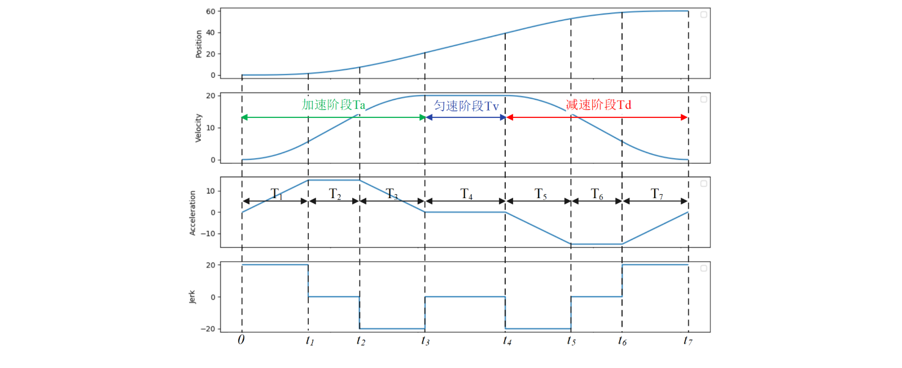

# 插补算法

常用的插补算法有：
- T型插补算法
- S型插补算法

## S型插补算法
1、 插补算法可以针对路径，可以针对速度，为了方便理解，以位置模式来进行代码编写。
2、 S曲线轨迹规划方法通过平滑的控制速度和加速度的变化，确保机器人在规划起点与目标点之间的平稳过渡，减少运动冲击，提高运动和控制精度

### 七段式插补原理
在S型曲线轨迹规划中，时间节点通常分为**7**个阶段：
- 加加速 (T1)：初始加速阶段。
- 匀加速 (T2)：保持恒定加速。
- 减加速 (T3)：开始减速。
- 匀速   (T4)：保持恒定速度。
- 加减速 (T5)：再次加速并减速。
- 匀减速 (T6)：保持恒定减速。
- 减减速 (T7)：最终减速至停止。

**结论**
- 对于S型速度曲线的**加速**，只使用$T_1,T_2,T_3$阶段
- 对于S型速度曲线的**减速**，只使用$T_5,T_6,T_7$阶段
- 对于S性位置曲线，则使用$T_1,T_2...T_6,T7$七个阶段
### 速度规划
加加速度，加速度的取值需要根据实际工况去调试，在本文档中暂时不考虑**自适应参数**这种方式
- 电机的额定转速$3000rmp/min$
- 最大速度差$6000rmp/min$[正转3000-反转3000]
- 最小速度差$100rmp/min$
- 系统响应时间
    - $\Delta_{v}<100rmp/min$,使用最小加速度及最小的加加速度，$\Delta_{T_s}<200ms$
    - $100rmp/min<\Delta_{speed}<3000rmp/min,\Delta_{T_s}<200ms$
    - $\Delta_{speed}>3000rmp/min$，$\Delta_{T_s}$根据最大加速度以及最大加加速度来限制，不做要求

### 加加速度
$ J_a = \frac{a}{t} $

### C代码编写

速度规划前提：
- 最大加速度$a_{max}$
- 加速阶段总时间$T_s$
    - 该时间是否固定还是随着速度差值而变化
- 最大速度差、最小速度差
- **边界条件**的计算

基础公式：
阶段1：
$V_1 = {V_0} + {\frac{1}{2}}{J_a}{t^2}$
阶段2:
$V_2 = V_1 + a(t-T1)$
阶段3:
$V_3 = V_2 - {\frac{1}{2}}{J_a}{t^2}$

运动学约束条件:
$t_{\text{acc}} \geq 2 \times \frac{a_{\text{max}}}{j_{\text{max}}} \quad (\text{最小加速时间})$
$s_{\text{min}} = \frac{v_{\text{max}}^2}{a_{\text{max}}} + \frac{a_{\text{max}}^3}{3j_{\text{max}}^2} \quad (\text{最小运动距离})$
速度规划:
1. 计算差值
2. 根据加速度及加加速速度$T_1,T_3$

## 数学公式
$T_1 = \frac{a_{\text{max}}}{j_{\text{max}}} \quad (\text{加加速段时间})$

$T_3 = T_1 \quad (\text{减加速段时间}, \text{对称})$

$T_5 = T_1 \quad (\text{加减速段时间}, \text{对称})$

$T_7 = T_1 \quad (\text{减减速段时间}, \text{对称})$

$T_2 = \frac{v_{\text{max}} - v_0 - j_{\text{max}}T_1^2}{a_{\text{max}}} \quad (\text{匀加速段时间})$

$T_6 = \frac{v_{\text{max}} - v_t - j_{\text{max}}T_1^2}{a_{\text{max}}} \quad (\text{匀减速段时间})$

$T_4 = \frac{s_{\text{total}} - s_{\text{acc}} - s_{\text{dec}}}{v_{\text{max}}} \quad (\text{匀速段时间})$

$s_{\text{acc}} = v_0(T_1 + T_2 + T_3) + \frac{1}{2}j_{\text{max}}T_1^2(2T_1 + 3T_2) + a_{\text{max}}T_2\left(T_1 + \frac{T_2}{2}\right)$

$s_{\text{dec}} = v_{\text{max}}(T_5 + T_6 + T_7) - \frac{1}{2}j_{\text{max}}T_5^2(2T_5 + 3T_6) - a_{\text{max}}T_6\left(T_5 + \frac{T_6}{2}\right)$

1. 加加速阶段 (0 ≤ t < T₁)
$$
\begin{align*}
j(t) &= j_{\text{max}} \\
a(t) &= j_{\text{max}} t \\
v(t) &= v_0 + \frac{1}{2}j_{\text{max}} t^2 \\
s(t) &= v_0 t + \frac{1}{6}j_{\text{max}} t^3
\end{align*}
$$
2. 匀加速阶段 (T₁ ≤ t < T₁+T₂)
$$
\begin{align*}
j(t) &= 0 \\
a(t) &= a_{\text{max}} \\
v(t) &= v_0 + \frac{1}{2}j_{\text{max}}T_1^2 + a_{\text{max}}(t - T_1) \\
s(t) &= s(T_1) + \left(v_0 + \frac{1}{2}j_{\text{max}}T_1^2\right)(t - T_1) + \frac{1}{2}a_{\text{max}}(t - T_1)^2
\end{align*}
$$
3. 减加速阶段 (T₁+T₂ ≤ t < T₁+T₂+T₃)
$$
\begin{align*}
j(t) &= -j_{\text{max}} \\
a(t) &= a_{\text{max}} - j_{\text{max}}(t - T_1 - T_2) \\
v(t) &= v(T_1+T_2) + a_{\text{max}}(t - T_1 - T_2) - \frac{1}{2}j_{\text{max}}(t - T_1 - T_2)^2 \\
s(t) &= s(T_1+T_2) + v(T_1+T_2)(t - T_1 - T_2) + \frac{1}{2}a_{\text{max}}(t - T_1 - T_2)^2 - \frac{1}{6}j_{\text{max}}(t - T_1 - T_2)^3
\end{align*}
$$
4. 匀速阶段 (T₁+T₂+T₃ ≤ t < T₁+...+T₄)
$$
\begin{align*}
j(t) &= 0 \\
a(t) &= 0 \\
v(t) &= v_{\text{max}} \\
s(t) &= s(T_1+T_2+T_3) + v_{\text{max}}(t - \sum_{i=1}^{3}T_i)
\end{align*}
$$
5. 加减速阶段 (T₁+...+T₄ ≤ t < T₁+...+T₅)
$$
\begin{align*}
j(t) &= -j_{\text{max}} \\
a(t) &= -j_{\text{max}}(t - \sum_{i=1}^{4}T_i) \\
v(t) &= v_{\text{max}} - \frac{1}{2}j_{\text{max}}(t - \sum_{i=1}^{4}T_i)^2 \\
s(t) &= s(\sum_{i=1}^{4}T_i) + v_{\text{max}}(t - \sum_{i=1}^{4}T_i) - \frac{1}{6}j_{\text{max}}(t - \sum_{i=1}^{4}T_i)^3
\end{align*}
$$
6. 匀减速阶段 (T₁+...+T₅ ≤ t < T₁+...+T₆)
$$
\begin{align*}
j(t) &= 0 \\
a(t) &= -a_{\text{max}} \\
v(t) &= v(\sum_{i=1}^{5}T_i) - a_{\text{max}}(t - \sum_{i=1}^{5}T_i) \\
s(t) &= s(\sum_{i=1}^{5}T_i) + v(\sum_{i=1}^{5}T_i)(t - \sum_{i=1}^{5}T_i) - \frac{1}{2}a_{\text{max}}(t - \sum_{i=1}^{5}T_i)^2
\end{align*}
$$
7. 减减速阶段 (T₁+...+T₆ ≤ t < T₁+...+T₇)
$$
\begin{align*}
j(t) &= +j_{\text{max}} \\
a(t) &= -a_{\text{max}} + j_{\text{max}}(t - \sum_{i=1}^{6}T_i) \\
v(t) &= v(\sum_{i=1}^{6}T_i) - a_{\text{max}}(t - \sum_{i=1}^{6}T_i) + \frac{1}{2}j_{\text{max}}(t - \sum_{i=1}^{6}T_i)^2 \\
s(t) &= s(\sum_{i=1}^{6}T_i) + v(\sum_{i=1}^{6}T_i)(t - \sum_{i=1}^{6}T_i) - \frac{1}{2}a_{\text{max}}(t - \sum_{i=1}^{6}T_i)^2 + \frac{1}{6}j_{\text{max}}(t - \sum_{i=1}^{6}T_i)^3
\end{align*}
$$

### 明确需求
- 周期性调用(1ms)
- 

