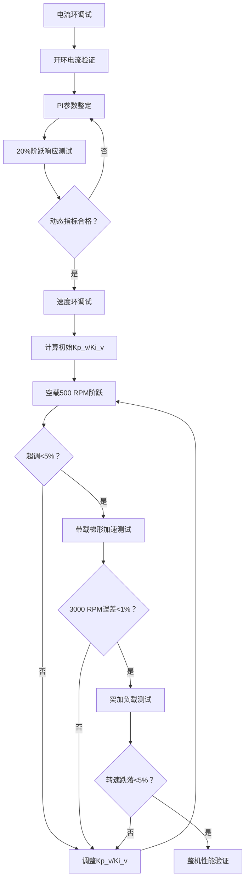

# 速度环调试

## 调试目标
速度跟踪平稳（无超调/振荡）
抗负载扰动能力强（突加负载时转速跌落 < 5%）

## 调试步骤：
- 调试步骤：
- 指令：速度阶跃 0 → 500 RPM（小范围起步）
- 带载验证（额定1.27 Nm）
- 梯形加速：0 → 3000 RPM（加速时间 ≥ 0.5s）

### 关键指标：
- 速度跟踪误差 < 1% (30 RPM)
- 加速过程电流平滑（无过流）

- 突加负载测试（在3000 RPM时施加1.27 Nm）：
    - ✅ 转速跌落 < 150 RPM
    - ✅ 恢复时间 < 0.1s

## 整机性能验证
- 全速域扫描
- 空载运行：0 → 3000 RPM → 0，检查低速（< 50 RPM）平稳性
### 动态负载测试
- 速度保持3000 RPM，负载在0 ↔ 1.27 Nm阶跃变化
- 过载能力测试
- 150%额定扭矩下加速至3000 RPM，持续1分钟
## 调试禁忌与技巧 
绝对禁止
- 未调电流环直接调速度环
- 带载启动调试
- 无保护下大阶跃测试

