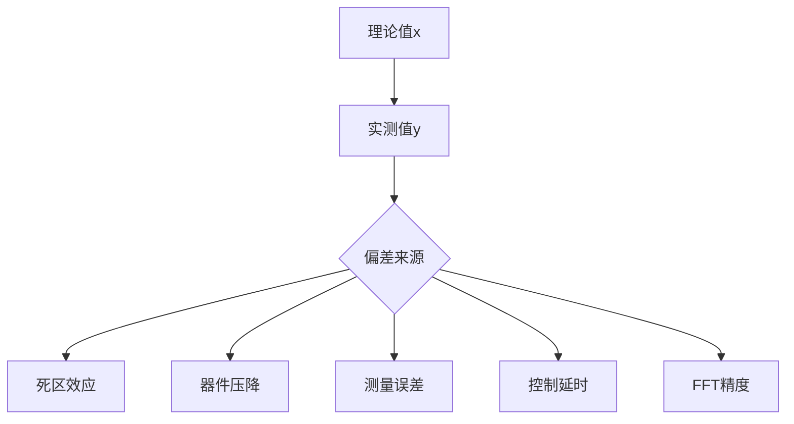
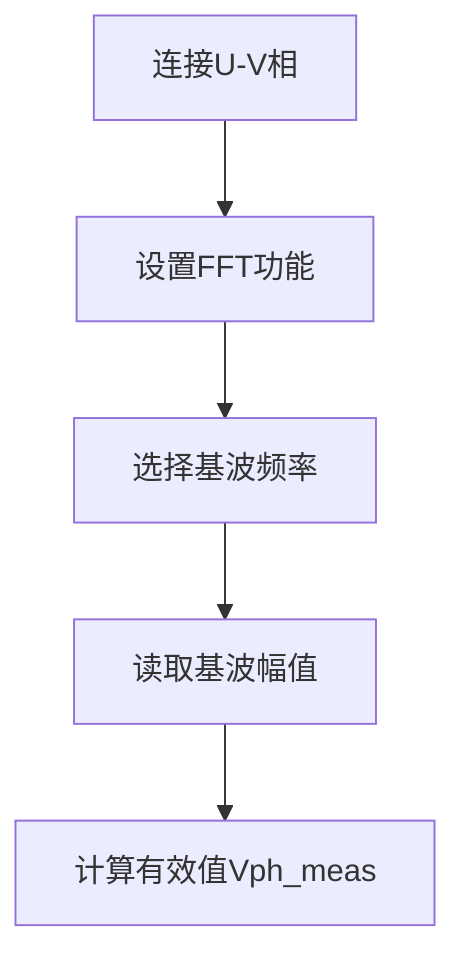

# 概述
测量在给定id iq下，逆变器输出的理论电压和最终作用在电机上实际电压的差值

## 整体回路


## 1.1 理论计算值 (x)
- Valpha/Vbeta有效值：
$V_{\alpha\beta\_rms} = \sqrt{\frac{1}{T}\int_0^T (V_\alpha^2 + V_\beta^2) dt} \approx \sqrt{V_\alpha^2 + V_\beta^2}$

- 相电压有效值：
$V_{ph\_theory} = \frac{V_{\alpha\beta\_rms}}{\sqrt{2}}$

## 1.2 实测值 (y)

### 1.2.1 示波器测量：
- 测量U-V线电压 $V_{uv}$
- FFT提取基波分量 $V_{uv_fund}$
- 计算相电压有效值：
    - $V_{ph\_meas} = \frac{V_{uv\_fund}}{\sqrt{3}}$

## 2.1 理论值与实测值关系
### 2.1.1 理想情况下
| 参数| 表达式| 关系|
|----|------|----|
| 理论值 x   | $V_{ph\_theory} = \frac{\sqrt{V_\alpha^2 + V_\beta^2}}{\sqrt{2}}$| 基准值         |
| 实测值 y   | $V_{ph\_meas} = \frac{V_{uv\_fund}}{\sqrt{3}}$                   | $y \approx x$ |

### 2.1.2 实际偏差来源

### 2.2.3 正确测量设备
| 参数       | 推荐值     | 说明                 |
|------------|------------|----------------------|
| 探头类型   | 高压差分探头 | 避免共模干扰         |
| 带宽       | ≥100MHz    | 准确捕获PWM边沿      |
| 采样率     | ≥10倍PWM频率 | 满足奈奎斯特准则     |
| FFT点数    | 4096+      | 提高频谱分辨率       |
| 窗函数     | Hanning    | 减少频谱泄漏         |

#### 2.2.3.1 操作步骤
**a.静态测试（电机堵转）**：
```C
# 伪代码
set_iq(4.0)  # 设置iq=4A
set_id(0.0)   # id=0
enable_motor()

# 读取控制器内部变量
valpha, vbeta = get_alpha_beta()
x = sqrt(valpha**2 + vbeta**2) / sqrt(2)  # 理论相电压有效值
```
#### 2.2.3.2示波器操作：

### 2.2.4. 预期结果分析
#### 2.2.4.1 理想关系曲线

```mermaid
graph
    title 理论值x vs 实测值y
    y-axis 相电压有效值 Vrms
    x-axis iq电流 A
    line 理论值 0 0, 2 5, 4 10, 6 15
    line 实测值 0 0, 2 4.8, 4 9.7, 6 14.5
```

#### 2.2.4.2 典型偏差范围
| 条件       | x-y偏差 | 主要因素     |
|------------|---------|--------------|
| 无补偿     | 10-20%  | 死区效应主导 |
| 有死区补偿 | 3-8%    | 器件压降残余 |
| 带全补偿   | <3%     | 测量误差为主 |

#### 2.2.4.3 验证公式
- 理论计算与实测值应满足：
  - $\frac{|x - y|}{x} \times 100\% < \varepsilon$
- 其中 $\varepsilon$ 为系统允许误差（通常<5%）

## 3. 误差来源及解决方案
### 3.1 主要误差源
| 误差源     | 影响程度 | 特征           |
|:-----------|:---------|:---------------|
| 死区时间   | ★★★      | 低速时最显著   |
| IGBT压降   | ★★       | 大电流时明显   |
| 测量误差   | ★★       | 全范围存在     |
| 控制延迟   | ★        | 动态过程显著   |

### 3.2 补偿措施
- 软件补偿：
```c
// 在SVPWM前添加补偿
void compensate_voltage(float* valpha, float* vbeta) {
    // 死区补偿
    float v_comp = DEAD_TIME * F_SW * V_DC;
    *valpha += sign(i_alpha) * v_comp;
    *vbeta += sign(i_beta) * v_comp;
    
    // 器件压降补偿
    *valpha += sign(i_alpha) * V_DROP;
    *vbeta += sign(i_beta) * V_DROP;
}
```

- 硬件补偿：
- 使用低导通电阻MOSFET
- 优化PCB布局减少寄生电感
- 增加RC吸收电路

## 4. 实验案例（48V系统，iq=4A）
### 4.1 理论计算
$$
\begin{align*}
V_q &= R_s \times i_q + \omega_e \psi_f \approx 0.1\Omega \times 4A = 0.4V \\
V_d &= -\omega_e L_q i_q \approx 0 \quad \text{(静态)} \\
V_{\alpha\beta} &= \sqrt{V_d^2 + V_q^2} = 0.4V \\
V_{ph\_theory} &= \frac{0.4V}{\sqrt{2}} \approx 0.283V_{rms}
\end{align*}
$$

### 4.2 实测结果
| 测量项              | 值                | 说明           |
|---------------------|-------------------|----------------|
| $V_{{uv}_{fund}}$       | 0.49V             | 线电压基波有效值 |
| $V_{{ph}_{meas}}$       | 0.49/1.732≈0.283V | 相电压有效值   |
| 偏差                | (0.283-0.283)/0.283=0% | 理想情况       |
### 4.3 实际考虑
- 死区影响：约0.5V压降
- 实际测量值：≈0.25V
- 偏差：约11.7%

**关键验证点：**
  - 静态测试时：$y \approx x$
  - 动态变化时：$\Delta y \propto \Delta x$
  - 线性关系：$y/x \approx 1$

**注意事项：**
- 必须在电机堵转下测试（避免反电动势影响）
- 需要高精度示波器和差分探头
- 考虑死区补偿的影响
- FFT设置对结果影响很大

**实验价值：**
- 验证控制算法准确性
- 校准电压利用率
- 优化死区补偿参数
- 评估系统能量转换效率
通过此实验，您可以定量评估FOC控制环路的电压输出精度，为系统优化提供可靠依据。实测值与理论值偏差应<5%（良好补偿下），这是高性能电机控制系统的关键指标。


