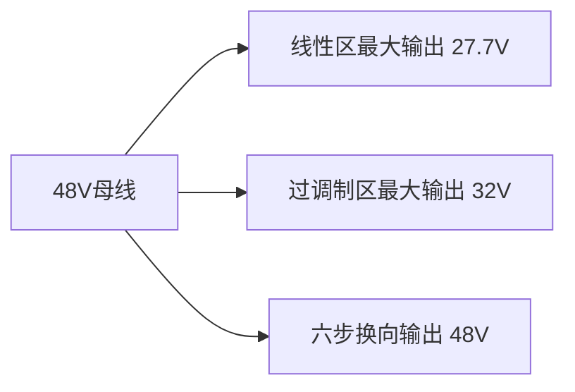

# 一、FOC控制中调制比

## 1.有效开关状态分析
| 状态 | Sa | Sb | Sc | 相电压 (对中性点) |
|------|----|----|----|-------------------|
| V0   | 0  | 0  | 0  | $0,\ 0,\ 0$ |
| V1   | 1  | 0  | 0  | $\frac{2}{3}V_{dc},\ -\frac{1}{3}V_{dc},\ -\frac{1}{3}V_{dc}$ |
| V2   | 1  | 1  | 0  | $\frac{1}{3}V_{dc},\ \frac{1}{3}V_{dc},\ -\frac{2}{3}V_{dc}$ |
| V3   | 0  | 1  | 0  | $-\frac{1}{3}V_{dc},\ \frac{2}{3}V_{dc},\ -\frac{1}{3}V_{dc}$ |
| V4   | 0  | 1  | 1  | $-\frac{2}{3}V_{dc},\ \frac{1}{3}V_{dc},\ \frac{1}{3}V_{dc}$ |
| V5   | 0  | 0  | 1  | $-\frac{1}{3}V_{dc},\ -\frac{1}{3}V_{dc},\ \frac{2}{3}V_{dc}$ |
| V6   | 1  | 0  | 1  | $\frac{1}{3}V_{dc},\ -\frac{2}{3}V_{dc},\ \frac{1}{3}V_{dc}$ |
| V7   | 1  | 1  | 1  | $0,\ 0,\ 0$ |

**其中**：  
- 1 = 上管导通，0 = 下管导通  
- $V_{dc}$ = 直流母线电压

### 1.1 等效电路图如下

### 1.2 基矢量的推导过程
- $I_A = I_B + I_C$
- $U_{AN} + U_{NB} = U_{DC}$
综合上面两式子，可以得出$U_{AN} = \frac{2U_{DC}}{3}$

### 1.3 最大线性电压

**最大线性电压的定义**：基矢量组成正六边形的内切圆直径（通过数学做图可以得出$V_{max} = \frac{U_{DC}}{\sqrt{3}}$）。
**内切圆半径计算:**
- 从六边形中心到边的垂直距离：
- $V_{max} = \frac{2}{3}U_{dc} \times \cos(30^\circ)$  
- $\cos(30^\circ) = \frac{\sqrt{3}}{2}$
- $V_{max} = \frac{2}{3}U_{dc} \times \frac{\sqrt{3}}{2} = \frac{\sqrt{3}}{3}U_{dc} = \frac{U_{dc}}{\sqrt{3}}$

- 从图上看，凡是***目标矢量***在内切圆内，可以通过基矢量随便合成
- ***目标矢量***当在内切圆外面，内接圆里面。此时无法通过基矢量合成任意的矢量，只能生成六个基矢量
- ***目标矢量***如果在外接圆外面，是绝对无法合成的

## 2.调制比定义
\[  m = \frac{V_{\text{ref}}}{V_{\text{max}}} = \frac{\sqrt{V_\alpha^2 + V_\beta^2}}{V_{dc}/\sqrt{3}} \]

其中：
- $V_{\text{ref}}$：参考电压矢量幅值
    - **代码中**，经过反park变换之后的$u_{\alpha},u_{\beta}$
    - $V_{ref} = \sqrt{{U_{\alpha}}^2 + {U_{\beta}}^2}$
- $V_{\text{max}} = V_{dc}/\sqrt{3}$：最大线性输出电压
- $V_{dc}$：母线电压

### 2.1 调制比工作区域
| 区域       | 调制比范围       | 特点                         |
|-----------|-----------------|-----------------------------|
| 线性区     | 0 ≤ m ≤ 1       | PWM波形完整，THD低           |
| 过调制区   | 1 < m ≤ 1.1547  | 电压利用率提高，波形畸变     |
| 六步换向   | m > 1.1547      | 最大电压输出，效率高         |

### 2.2 电压利用率

## 3. 物理意义验证
### 3.1 相电压与空间矢量的关系
在平衡三相系统中，空间矢量幅值等于相电压峰值：
- $|\vec{V_s}| = V_{ph\_peak}$
### 3.2 线电压与相电压关系
- $V_{LL\_rms} = \sqrt{3} \times V_{ph\_rms}$
在峰值关系上：
- $V_{LL\_peak} = \sqrt{3} \times V_{ph\_peak}$

### 3.3 最大线电压验证
- $V_{LL\_max} = \sqrt{3} \times V_{max} = \sqrt{3} \times \frac{U_{dc}}{\sqrt{3}} = U_{dc}$
这与实际最大线电压一致。
## 4. 实例计算（$U_{dc} = 48V$）
- 最大相电压峰值：
- $V_{ph\_max} = \frac{48}{\sqrt{3}} \approx 27.71V$
- 最大线电压峰值：
- $V_{LL\_max} = \sqrt{3} \times 27.71 \approx 48V$

